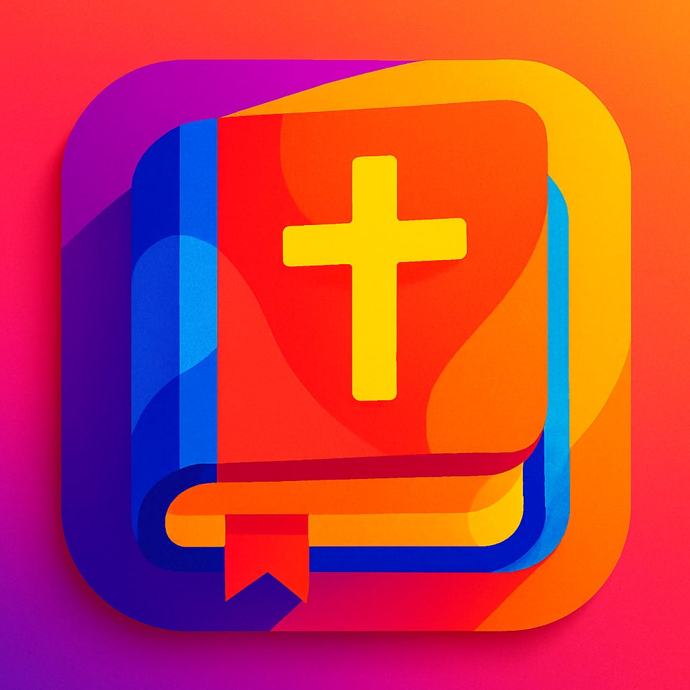
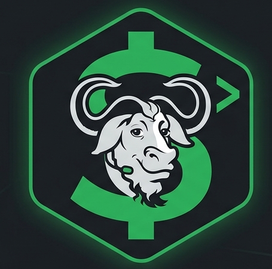
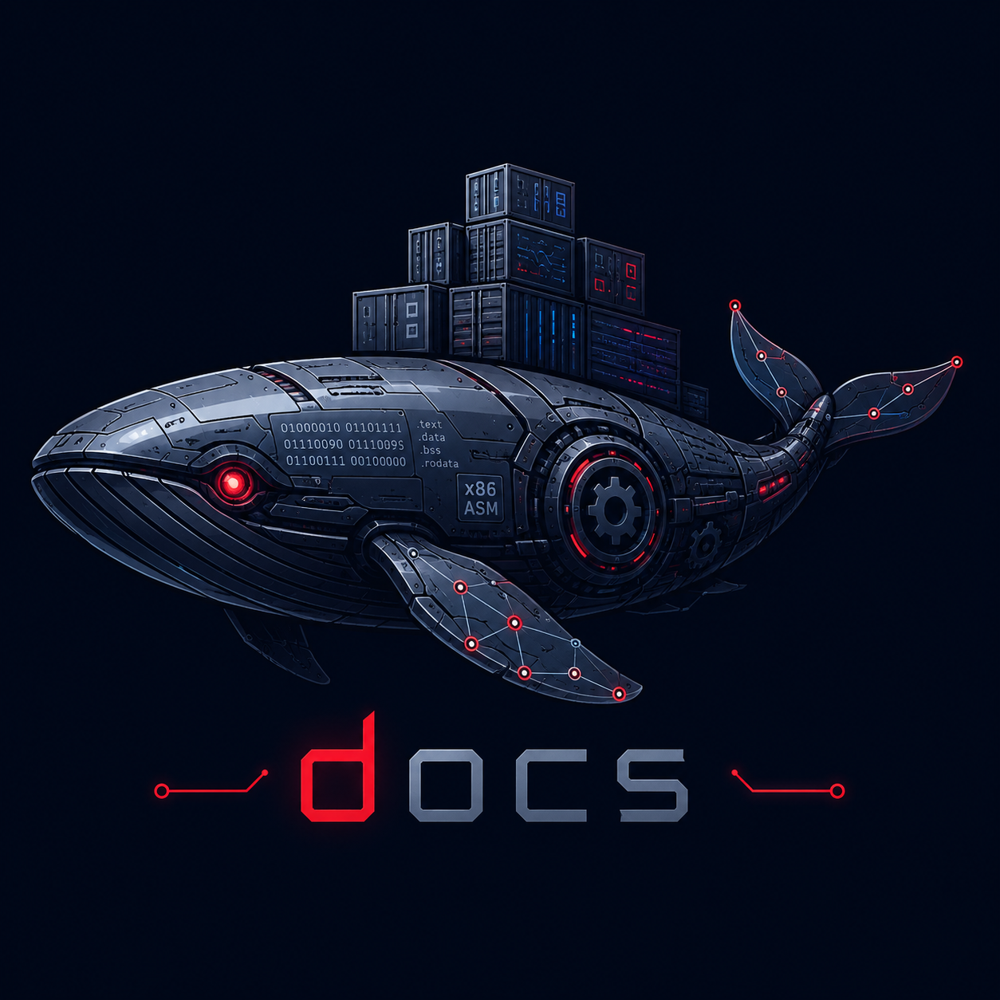

# Ruan Gustavo Soares da Silva </img> </img>

Tive os meus primeiros contatos com a área de TI aos 15 anos quando realizei um curso de informática básica junto com a minha mãe, desde então eu adentrei na área e desenvolvi cada vez mais interesse em segurança cibernética e baixo nível.

Tenho capacidade, responsabilidade e interesse para lidar com infraestrutura, engenharia, analise, suporte e gestão ágil de projetos, além de buscar conhecimento e pensamento crítico em como posso fornecer segurança e boa performance em dispositivos antigos e atuais.

Atualmente me encontro graduando em Sistema de Informação, mas pretendo extender para Engenharia de Software e após isso iniciar uma pós-graduação em Segurança da Informação e Hacking Pentester.

## 🛠️ Stack
* **Backend:** Java e Typescript
* **Frontend:** Flutter e React
* **Bancos de Dados:** PostgreSQL, MariaDB
* **DevOps & Infraestrutura:** Docker, Git, Linux e Shell
* **Metodologias:** Scrum, Kanban e XP

## 📚 Estudos Complementares
* Wget e cURL
* C/C++ e Assembly
* Lazyvim e Tmux

## 🚀 Projetos em Destaque
### <a href="https://play.google.com/store/apps/details?id=com.bibleAplication.app"> Bíblia & Harpa</a>
<table>
  <tr>
    <td align="center" valign="middle" width="160px">
      
    </td>
    <td valign="top">
      
Aplicativo Mobile para leitura Bíblica e conteúdos sagrados com meta de expansão para Multiplataforma, assim consolidando o público android e almejando alcançar parte do público IOS.

      
<b>🚀 Tecnologias:</b> Flutter, SharedPreferences, Hive e shell

      
<b>🚀 Arquitetura:</b> Refatorando para MVVM + Riverpod

    </td>
  </tr>
</table>

### <a href="https://github.com/ruan-slv/bashub.git">Bashub</a>
<table>
  <tr>
    <td align="center" valign="middle" width="160px">
      
    </td>
    <td valign="top">
      
Fork do <a href="https://github.com/rfdouro/DEVAPP.git">DEVAPP</a>, tem como objetivo fornecer um executável CLI para instalações e execução de ferramentas e programas durante o processo de desenvolvimento.

      
<b>🚀 Tecnologias:</b> Shell

    </td>
  </tr>
</table>

### <a href="https://github.com/ruan-slv/docs.git">Docs</a>
<table>
  <tr>
    <td align="center" valign="middle" width="160px">
      
    </td>
    <td valign="top">
      
Repositório para centralização de documentos sobre ferramentas de desenvolvimento com proposta de facilitar buscas para aprendizado e afins. 

    </td>
  </tr>
</table>

## 📊 Formação e Certificações
* **Graduação:** Bacharelado em Sistemas de Informação – Unisales *(Em andamento)*
* **Técnico:** Informática Básica - SENAC, Análise e Desenvolvimento de Sistemas – SENAI
* **Idiomas:** Inglês Intermediário – Wizard *(Em andamento)*
* **Complementares:** Introdução ao Hacking e Pentest (Solyd), Design Sprint & Copilot (Enap), Linux (Curso em Vídeo).

---

## Contatos
* **LinkedIn:** [in/ruanslv16](https://linkedin.com/in/ruanslv16)
* **E-mail:** [ruan.work16@gmail.com](mailto:ruan.work16@gmail.com)
* **Discord:** [ruan._.9](https://discord.gg/xW2W6qk6T)
* **Youtube:** [ruan_silva](https://www.youtube.com/@ruansilvaslv)
